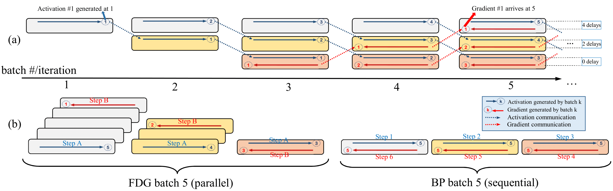
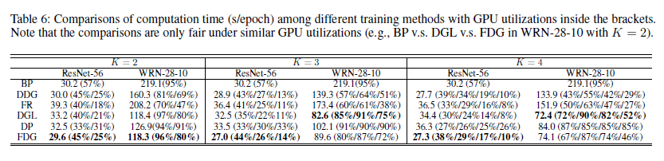

# Fully Decoupled Neural Network Learning Using Delayed Gradients (FDG)

## Introduction

This repository provides the PyTorch codes for the paper "Fully Decoupled Neural Network Learning Using Delayed Gradients" http://arxiv.org/abs/1906.09108. 

The FDG splits a neural network into multiple modules that are trained independently and asynchronously in different GPUs. We also introduce a gradient shrinking process to reduce the stale gradient effect caused by the delayed gradients. The proposed FDG is able to train very deep networks (>1000 layers) and very large networks (>35 million parameters) with significant speed gains while outperforming the state-of-the-art methods and the standard BP.

For any question and comments, please contact us using HUIPING001@e.ntu.edu.sg

## Environment

1. Python 3.6
2. Pytorch 1.0
3. CUDA 10.1

## Algorithm illustration 



## Some notation
K is the number of split modules; *β* is a gradient shrinking factor (for *β*=1, there is no gradient shrinking); <sup>\*</sup>  means the results are rerun.

## Results

### Setting
We use SGD optimizer with an initial learning rate of 0.1. The momentum and weight decay are set as 0.9 and $5\times 10^{-4}$ respectively. All the models are trained using a batch size of 128 for 300 epochs. The learning rate is divided by 10 at 150, 225 and 275 epochs. The test errors of the FDG are reported by the median of 3 runs.

### K=2, CIFAR-10

| Architecture | \# params |   BP                     | DDG                     |   DGL      | FR    |     FDG                         |
|:-------------|:---------:|:-------------------------|:-----------------------:|:----------:|:----------:|:-------------------------------:|
| ResNet-20    |   0.27M   | 8.75%/7.78%<sup>\*</sup> |   \-                    |     \-     |        | 7.92%(*β*=1)/**7.23**%(*β*=0.2) |
| ResNet-56    |   0.46M   | 6.97%/6.19%<sup>\*</sup> | 6.89%/6.63%<sup>\*</sup>|     6.77%<sup>\*</sup>     |6.07%<sup>\*</sup>| 6.20%(*β*=1)/**5.90**%(*β*=0.5) |
| ResNet-110   |   1.70M   | 6.41%/5.79%<sup>\*</sup> | 6.59%/6.26%<sup>\*</sup>| 6.50%/6.26%<sup>\*</sup> |5.76%<sup>\*</sup>| 5.79%(*β*=1)/**5.73**%(*β*=0.5) |
| ResNet-18    |   11.2M   | 6.48%/4.87%<sup>\*</sup> |   5.00%<sup>\*</sup>                 |    5.21%<sup>\*</sup>   |4.80%<sup>\*</sup>| 4.82%(*β*=1)/**4.79**%(*β*=0.8) |
| WRN-28-10    |   19.4M   | 7.93%/5.53%<sup>\*</sup> |   \-                    |     \-     || 5.50%(*β*=1)/**5.49**%(*β*=0.7) |
| WRN-28-10    |   36.5M   | 4.00%/4.01%<sup>\*</sup> |   \-                    |     \-     || 4.13%(*β*=1)/**3.85**%(*β*=0.7) |

### K=2, CIFAR-100

| Architecture | \# params |    BP                          |   DDG  |   DGL  |   FR  |        FDG                        |
|:-------------|:---------:|:-------------------------------|:------:|:------:|:------:|:---------------------------------:|
| ResNet-56    |   0.46M   | 30.21%/27.68%<sup>\*</sup> | 29.83%/28.44%<sup>\*</sup> |29.51%<sup>\*</sup> |28.39%<sup>\*</sup>|  27.87%(*β*=1)/**27.49%**(*β*=0.4)   |
| ResNet-110   |   1.70M   | 28.10%/25.82%<sup>\*</sup>     | 28.61%/27.16%<sup>\*</sup> |26.80%<sup>\*</sup>|26.31%<sup>\*</sup>| 25.73%(*β*=1)/**25.43**%(*β*=0.5) |
| ResNet-18    |   11.2M   | 22.35%<sup>\*</sup>            |   22.74%<sup>\*</sup>   |22.24%<sup>\*</sup>|22.88%<sup>\*</sup>| 22.78%(*β*=1)/**22.18**%(*β*=0.5) |
| WRN-28-10    |   36.5M   | 19.2%/19.6%<sup>\*</sup>                            |   \-   |\-|\-| 20.28%(*β*=1)/**19.08**%(*β*=0.6) |

### For multiple GPUs (CIFAR-10 with ResNet-56)

|   Split    |   BP| DDG| DGL| FR| FDG|
|:----------:|:-----:|----:|:-----:|:-----:|:------:|
| *K*=2  |6.19% |6.60%<sup>\*</sup>|6.77%<sup>\*</sup>|6.07%<sup>\*</sup>|6.20%(*β*=1)/**5.90**%(*β*=0.5)|
| *K*=3 | 6.19% |6.50%<sup>\*</sup>|8.88%<sup>\*</sup>|6.33%<sup>\*</sup>|6.20%(*β*=1)/**6.08**%(*β*=0.5)|
| *K*=4 | 6.19% |6.61%<sup>\*</sup>|9.65%<sup>\*</sup>|6.48%<sup>\*</sup>|6.83%(*β*=1)/**6.14**%(*β*=0.5)|

### Time Performance
We provide the time performances of several techniques including the data parallelization (DP). Under similar GPU utilization, our FDG is the fastest among the methods.

## Citation
```
@article{Zhuang2019,
author = {Zhuang, Huiping and Wang, Yi and Liu, Qinglai and Lin, Zhiping},
eprint = {1906.09108},
month = {jun},
title = {{Fully Decoupled Neural Network Learning Using Delayed Gradients}},
url = {http://arxiv.org/abs/1906.09108},
year = {2019}
}
```
